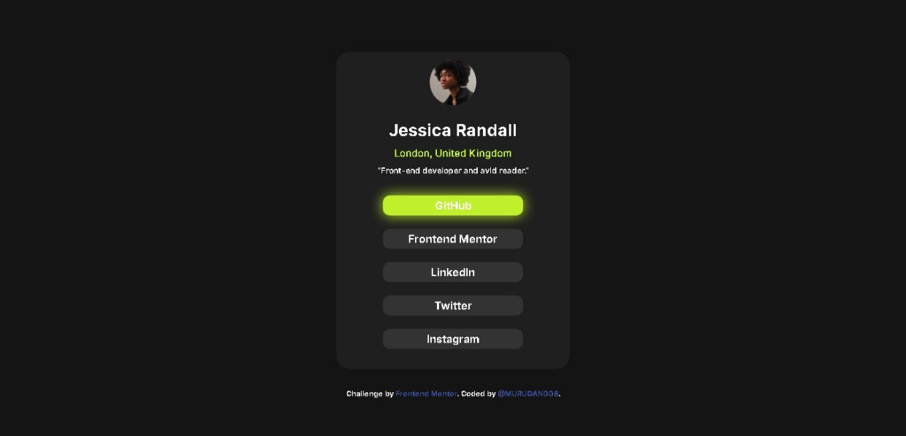

# Social-Links-Profile


# Frontend Mentor - Social links profile solution

This is a solution to the [Social links profile challenge on Frontend Mentor](https://www.frontendmentor.io/challenges/social-links-profile-UG32l9m6dQ). Frontend Mentor challenges help you improve your coding skills by building realistic projects. 

## Table of contents

- [Overview](#overview)
  - [The challenge](#the-challenge)
  - [Screenshot](#screenshot)
  - [Links](#links)
- [My process](#my-process)
  - [Built with](#built-with)
  - [What I learned](#what-i-learned)
- [Author](#author)


## Overview

- This is a social link profile project for the frontend mentor challenge

### The challenge

Users should be able to:

- See hover and focus states for all interactive elements on the page

### Screenshot

- Desktop View:-



- Mobile View:-


### Links

- Solution URL: [Click here!]()
- Live Site URL: [Click here!](https://murugan008.github.io/Social-Links-Profile/)

## My process

### Built with

- HTML5
- CSS
- Flexbox
- CSS Grid
- Mobile-first workflow


### What I learned


 In this project i am use and learn about grid and pseudo classes

```css
    .grid{
        width: 230px;
        margin: 20px auto 20px;
        display: grid;
        grid-template-columns: 100%;
        grid-template-rows: repeat(5, 20%);
    }
    a{
        background-color: var(--Grey);
        height: 30px;
        display: flex;
        justify-content: center;
        align-items: center;
        border-radius: 10px;
        transition: 2s;
    }
    h4{
        font-size: 1.6rem;
    }
    a:hover{
        background-color: var(--Green);
        filter: drop-shadow(1px 1px 10px var(--Green));
        transform: translateY(-3px);
        h4{
        color: var(--Off-Black);
        }
        transition: 1s;
    }
    a:active{
        background-color: var(--Green);
        transform: translateY(3px);
        transform: scale(0.7);
    }
    a:focus{
        background-color: var(--Green);
        filter: drop-shadow(1px 1px 10px var(--Green));
        outline: transparent;
        h4{
            color: black;   
        }
        
    }
```


## Author

- Frontend Mentor - [@MURUGAN008](https://www.frontendmentor.io/profile/MURUGAN008)


